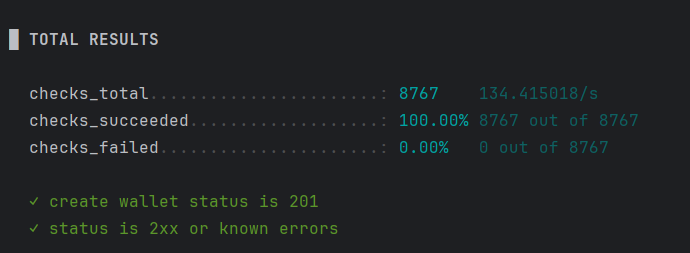

### 🏷️ Type: Interview Assignment

# Wallet Service

## ✏️ Developer's Note

Although the original assignment **did not require implementing operation history or a separate Operation entity**, I decided to include this functionality as an **additional feature**.

- A dedicated `operation-service` was created to store and retrieve all wallet operations.
- Each `DEPOSIT` or `WITHDRAW` action is saved asynchronously for traceability.
- This improves the system's extensibility and aligns with common real-world financial service expectations.

I believe this enhancement adds value to the architecture and demonstrates initiative and attention to long-term maintainability.

---

## 📌 Overview

This project implements a minimal wallet management system with two main features:

- Perform wallet operations (`DEPOSIT` / `WITHDRAW`)
- Retrieve wallet balance by UUID

The system is capable of handling **high-concurrency scenarios (1000 RPS per wallet)**, with appropriate safeguards to avoid race conditions, partial updates, and 5xx errors.

## 🧩 Architecture

This project consists of the following services:


| Service               | Description                                 |
|-----------------------|---------------------------------------------|
| **wallet-service**     | Handles wallet creation, balance, and updates |
| **operation-service**  | Stores and retrieves wallet operations       |
| **PostgreSQL**         | Relational database for persistence          |

## 🛠️ Tech Stack

- Java 17
- Spring Boot 3
- Spring Data JPA
- PostgreSQL
- Liquibase
- Docker & Docker Compose
- Maven
- Lombok
- JUnit 5 / Spring Test

## 🚀 Features

### ✅ Wallet Operations
- `POST /api/v1/wallet`
    - Performs a wallet operation (DEPOSIT or WITHDRAW)
    - Operation is executed **transactionally and thread-safe**
- `GET /api/v1/wallets/{walletId}`
    - Returns current wallet balance

### ✅ Operation History
- All operations are saved asynchronously in `operation-service`
- Endpoints can return paginated operation history (if needed)

### ✅ Concurrency & Consistency
- Uses **pessimistic locking** (`SELECT ... FOR UPDATE`) to avoid race conditions
- Ensures operations are **atomic**, consistent, and **fully isolated**
- Designed to handle **1000 RPS per wallet** without data corruption

### ✅ Validation & Error Handling
- ❌ Non-existing wallet → `404 Not Found`
- ❌ Invalid JSON payload → `400 Bad Request`
- ❌ Insufficient balance → `422 Unprocessable Entity`
- ❌ Unsupported operation type → `400 Bad Request`
- All errors are returned in a consistent JSON format


## 🧪 Performance Testing (RPS with K6)

To ensure the system handles **high concurrency (1000 RPS on a single wallet)** without data loss or 5xx errors, stress testing was performed using [K6](https://k6.io/), a modern load testing tool.

### 🔍 Scenario
- Tested concurrent `POST /api/v1/wallet` operations (DEPOSIT/WITHDRAW)
- 1000 requests per second targeting the same wallet
- Monitored latency, error rate, and consistency of balance
- Verified no 5xx errors occurred
- Wallet balance matched expected final value, confirming transactional integrity




## ▶️ How to Run

### 1. 🐳 Docker-Based Launch

This is the recommended way to run the full system.

#### Requirements:
- [Docker](https://www.docker.com/)
- [Docker Compose](https://docs.docker.com/compose/)

#### Run for all project
```bash
mvn clean package -DskipTests
```

#### 1. Run the full stack:
```bash
docker-compose up --build
```
#### 3. Wait for the services to initialize in the following order

#### 4. Available Endpoints all on localhost:
- http://localhost:8080/

You can test endpoints using Postman or curl.

---
